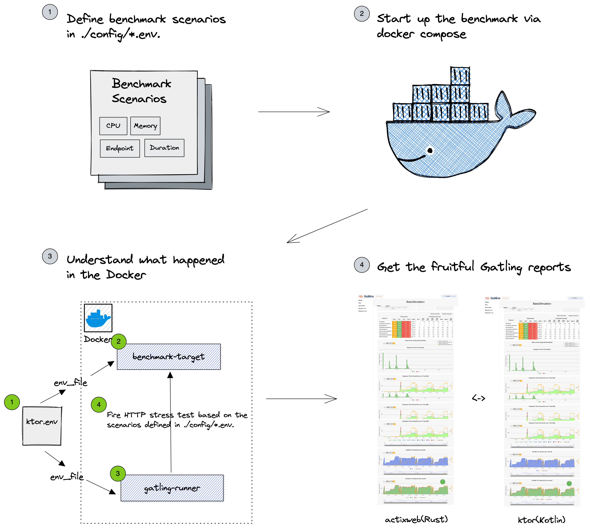
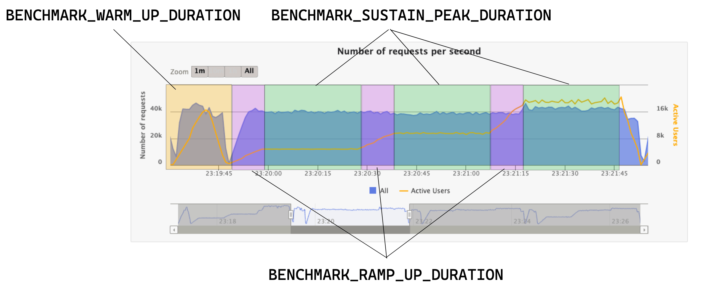

## Project Status: Under heavy development

This project is originally designed for testing the performance of Kotlin Coroutines, Reactor, 
and cutting edge Java 19 Virtual Threads for my application of KotlinConf 2023 talk (TBC, under evaluation). 

Meanwhile, I realized if my work go the extra miles, it can be further extended to benchmark generic frameworks. 

Check out the interesting result at [https://benchmarks.gaplo.tech](https://benchmarks.gaplo.tech).

Contributions are welcome. [Rust and C# implementations were contributed by others!](https://github.com/gaplo917/kotlin-coroutine-benchmark/pulls?q=is%3Apr+is%3Aclosed) 
If you are interested to add your favourite framework in this project, take a look on their PRs for reference.

| Goal                                                       | Description                                                                                                                             |
|------------------------------------------------------------|-----------------------------------------------------------------------------------------------------------------------------------------|
| ✅ JMH microbenchmark for JVM                               | Compare asynchronous solutions (Kotlin Coroutine, Reactor, and Java 19 Virtual Threads) in nano-seconds level                           |
| ✅ [Gatling](https://gatling.io/) End-to-End HTTP benchmark | Utilizing [Gatling](https://gatling.io/) to generate real-world HTTP load and output fruitful performance report                        |
| ✅ Fully Containerized (Zero Dependencies)                  | Single `docker compose` dependency is enough to get started. Say good bye to countless installations of project dependencies.           |
| ✅ Scalable Design                                          | Adding a new benchmark target only needs a Dockerfile and a simple configuration.                                                       |
| ✅ Dev-Friendly Design                                      | Run the benchmark in **your local** machine instead of trusting the report online. Easy to make code changes to run to learn.           |
| ✅ Zero Code Configuration (similar to `ab` / `wrk`)        | Kotlin implementation of utilizing Gatling to work like `ab` or `wrk` CLI tools                                                         |
| ✅ High Benchmark Concurrency                               | Thanks for the containerization. Tested 20k+ concurrent users with no problem. No more file description or TCP connection limit issues. |
| ✅ Continuous Concurrency Ramp Up and Sustain               | Discover the application performance across continuous time series charts with configuration ramp up and sustain duration.              |
| ✅ Automatically Publish Gatling Reports                    | Automatically parse Gatling output and upload to https://benchmarks.gaplo.tech CDN                                                      |
| 🔧 GitHub Actions (Automated Provisioning on Cloud)        | Automatically provision machines to run benchmarks                                                                                      |
| 🔧 GitHub Actions (self-host action runner)                | Create a action runner base image on cloud and provision faster to run benchmarks                                                       |
| 🔧 All-in-one Benchmark Summary Aggregation                | Aggregate Gatling simulation log to visualize avg. request/s, response time                                                             |
| 🔧 Implement major features complaint with `ab`            | Support to define http methods, cookies, headers, payload, http connections, custom cert...etc                                          |

| JMH Scenario (Microbenchmark in JVM)         | Goal                                                                                                                         |
|----------------------------------------------|------------------------------------------------------------------------------------------------------------------------------|
| ✅ Kotlin Coroutine Dispatcher                | Compare Coroutine Dispatchers w/ and w/o computational workload                                                              |
| ✅ Reactor Scheduler                          | Compare Rector Schedulers w/ and w/o computational workload                                                                  |
| ✅ Blocking IO Wrapper                        | Compare Kotlin Coroutine, Reactor, and Java virtual threads as a blocking IO wrapper.                                        |
| ✅ Non-Blocking IO Wrapper                    | Compare Kotlin Coroutine, Reactor, and Java virtual threads as a non-blocking IO wrapper.                                    |
| ✅ Coroutine Context Switching                | Compare Kotlin Coroutine context switching w/ and w/o computational workload                                                 |
| ✅ Diminishing of return of large thread pool | Demonstration of large thread pool is not efficient by wrapping wrapping blocking IO in range of 100 - 4000 a IO thread pool |
| ✅ Virtual Threads in JDK 19                  | Compare Virtual Threads and Non-Blocking IO performance difference.                                                          |
| ✅ Structured Concurrency                     | Compare Kotlin Coroutine and JDK 19 structured concurrency feature                                                           |

| Gatling Scenario    | Goal                                                                                                                                                                       |
|---------------------|----------------------------------------------------------------------------------------------------------------------------------------------------------------------------|
| ✅ Two dependent I/O | Compare various implementations of non-blocking IO or blocking IO  within its HTTP framework. (i.e. Spring w/ Kotlin Coroutine, Reactive Stream, and Java virtual threads) |
| 🔧 Two parallel I/O | Compare various implementations of non-blocking or blocking IO implementation                                                                                              |
| ...                 |                                                                                                                                                                            |


## KotlinConf2023 (TBC, under evaluation): Deep Dive the Real-World Performance of Kotlin Coroutine (V.S. Reactor, Java Virtual Threads)

As all we know, Kotlin Coroutine has provided us a good way to structure our asynchronous codes
in a readable sequence. It is also theoretically more CPU-friendly that reduces unnecessary context
switching to run faster and allow the CPU to work more. However, theory is just the texts on paper,
developers need real world scenarios and performance metrics to make better decisions.

> When we talk about "Real World Performance", we should measure both **machines** and **developers**.

I believe the following questions popped up in my mind will also in yours:

In machine world,

- How fast is Kotlin Coroutine compared to other popular asynchronous solutions in machine?

- What are the performance differences if I misused Kotlin coroutine?

- What are the performance differences when the application runs heavy-blocking-IO or
  heavy-non-blocking-IO operations?

- What are the performance differences when I switched to Kotlin Coroutine in Spring Boot MVC?

- Hardware is cheap and eventually will be cheaper in the future, why should I consider Kotlin Coroutine?

In developer world,

- What are the learning curve of writing performant codes in Kotlin Coroutine compared to Java Reactor?

- What changes required to apply Kotlin Coroutine into existing Spring Boot project?

- Java virtual threads and Structured Concurrency feature are coming to future Java, why should I consider Kotlin Coroutine?

This is a technical talk to deep dive the performance differences on Kotlin Coroutine,
Java virtual threads, and Reactor backed by a list of JMH benchmarks on the JVM to answer those questions.

## Project Goal

This project is to show the performance of using Kotlin Coroutine, Reactor, and
Java virtual threads on both ideal(JMH) and real world(end-to-end) scenarios.

1. Find out the performance differences between the Reactor and Kotlin Coroutine.
2. Find out the performance differences when handling blocking IO and non-blocking IO.
3. Find out the performance differences in the future state of JVM (combined Kotlin Coroutine and Reactor with JDK 19 virtual threads)
4. Find out the cost of context switching and scheduling in Kotlin Coroutine, Reactor, and java virtual threads.
5. Compare the JVM-based(ktor, spring boot, vert.x) Http server performances in heavy non-blocking IO
6. Compare with nodejs, Rust, C#, and more Http server performances in heavy non-blocking IO

## Getting Started (JMH)

Use JMH to run micro-benchmarks on Kotlin Coroutine, Virtual Threads, and Reactor.

```bash

# Run JMH benchmark
cd jmh;
./gradlew mainBenchmark;

```

## Getting Started (end-to-end HTTP benchmark)

All benchmark targets are designed to run in Docker container and use [Gatling](https://gatling.io/)
to run the load test and get the benchmark of end-to-end result.



### 1. Define benchmark scenarios in `./config/*.env`

In `./config/*.env`, there are key configurations to control gatling's concurrency.


### 2. Start up the benchmark

First, you need to build the docker image for each application you want to test.

You might need at least 7 vCPU and 16GB Memory resources for the whole docker engine.

Run a single benchmark with the follow commands, it will build automatically if there is no available images.

```bash
# In case you need to change architecture to build cross platform
DOCKER_DEFAULT_PLATFORM=linux/arm64/v8 # Mac M1/M2 CPU
DOCKER_DEFAULT_PLATFORM=linux/amd64 # Intel / AMD CPU

# Run single benchmark (i.e. ktor)
ENV_FILE=./config/ktor.env
docker compose --env-file $ENV_FILE build && \
docker compose --env-file $ENV_FILE up -d benchmark-target && \
docker compose --env-file $ENV_FILE up gatling-runner && \
docker compose --env-file $ENV_FILE down
```

OR run all benchmarks through the scripts

```bash
# Run all benchmarks, config available in `./config/`
sh all-gatling-benchmarks.sh
```

### 3. During the test, Grab a ☕️ or 🍵 and wait.

- `gatling-runner` output all the logs to `./logs/`

- gatling reports available in `./reports/`

### 4. Study the Gatling reports

Checkout the benchmark report in `./reports/`. Hope you would have a
great understanding of your applications!

### (Optional) Grafana Dashboard to view application metrics

1. Un-comment the `prometheus` and `grafana` services in `docker-compose.yaml`
2. Make sure the application support prometheus, and add job and endpoints in `prometheus.yml`

```bash
ENV_FILE=./config/ktor.env
docker compose --env-file $ENV_FILE up -d benchmark-target prometheus grafana &&
```

Go to http://localhost:3000 to configure the grafana dashboard.

## Benchmark Environment

| Configuration  | Description                       |
|----------------|-----------------------------------|
| Platform       | x86 Intel                         |
| Cloud Provider | Digital Ocean                     |
| CPU            | 8 vCPU (Dedicated, CPU-Optimized) |
| RAM            | 16GB Memory                       |
| Disk           | 100GB SSD                         |
|                |                                   |

## Benchmark Result (WIP)

JMH: In the source codes comment sections

End to End: https://benchmarks.gaplo.tech/index.html

## Conclusion (WIP)

(Coming Soon)

## Develop Gatling Kotlin Project

After making Gatling code changes, make sure you run to build the docker image.

```bash
docker compose --env-file $ENV_FILE build gatling-runner
```

## Contribution

1. Add new web framework `XXX` implementation that is equivalent to others languages.
2. Add gatling benchmark configuration in `./config/xxx.env`

## Troubleshooting

```bash
# Remove orphans containers
docker compose --env-file ./config/ktor.env down --remove-orphans
```
