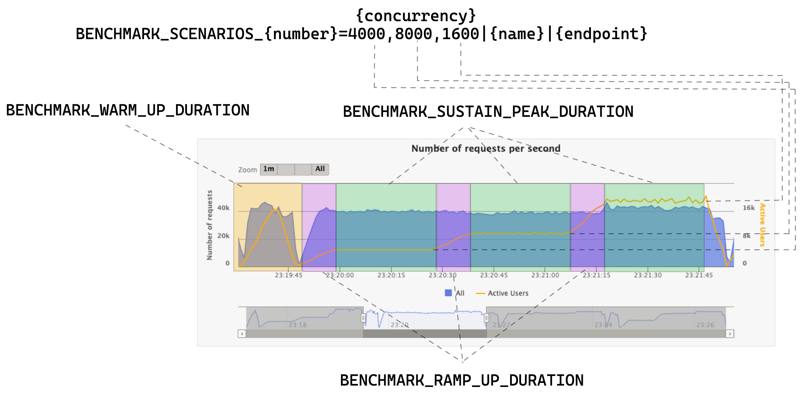

# Generic HTTP benchmark

Check out the interesting result at [https://benchmarks.gaplo.tech](https://benchmarks.gaplo.tech).

Contributions are
welcome. [Rust and C# implementations were contributed by others!](https://github.com/gaplo917/generic-http-benchmark/pulls?q=is%3Apr+is%3Aclosed)
If you are interested to add your favourite framework in this project, take a look on their PRs for reference.

| Goal                                         | Description                                                                                                                             |
|----------------------------------------------|-----------------------------------------------------------------------------------------------------------------------------------------|
| ✅ End-to-End HTTP benchmark                  | Utilizing [Gatling](https://gatling.io/) to generate real-world HTTP load and output fruitful performance report                        |
| ✅ Fully Containerized                        | Single `docker compose` dependency is enough to get started. Say good bye to countless installations of project dependencies.           |
| ✅ Scalable Design                            | Adding a new benchmark target only needs a Dockerfile and a simple configuration.                                                       |
| ✅ Dev-Friendly Design                        | Run the benchmark in **your local** machine instead of trusting the report online. Easy to make code changes to run to learn.           |
| ✅ Zero Code Configuration                    | Kotlin implementation of utilizing Gatling to work like `ab` or `wrk` CLI tools                                                         |
| ✅ High Concurrency                           | Thanks for the containerization. Tested 20k+ concurrent users with no problem. No more file description or TCP connection limit issues. |
| ✅ Continuous Concurrency Ramp Up and Sustain | Discover the application performance across continuous time series charts with configuration ramp up and sustain duration.              |
| ✅ Gatling Reports Automation                 | Automatically parse Gatling output and upload to https://benchmarks.gaplo.tech CDN                                                      |
| 🔧 Self-host action runner                   | Create a self-hosted action runner base image on cloud and provision faster to run benchmarks                                           |
| 🔧 Provisioning Automation                   | Use GitHub Actions to automatically provision a self-hosted action runner to run benchmarks on                                          |
| 🔧 Report Summary                            | Aggregate all-in-one Gatling simulation log to visualize avg. request/s, response time                                                  |
| 🔧 More features complaint with `ab`         | Support to define http methods, cookies, headers, payload, http connections, custom cert...etc                                          |
| ...more                                      |                                                                                                                                         |

| Gatling Scenario    | Goal                                                                                                                                                                       |
|---------------------|----------------------------------------------------------------------------------------------------------------------------------------------------------------------------|
| ✅ Two dependent I/O | Compare various implementations of non-blocking IO or blocking IO  within its HTTP framework. (i.e. Spring w/ Kotlin Coroutine, Reactive Stream, and Java virtual threads) |
| 🔧 Two parallel I/O | Compare various implementations of non-blocking or blocking IO implementation                                                                                              |
| ...                 |                                                                                                                                                                            |

## Getting Started (end-to-end HTTP benchmark)

All benchmark targets are designed to run in Docker container and use [Gatling](https://gatling.io/)
to run the load test and get the benchmark of end-to-end result.


### 1. Define benchmark scenarios in `./config/*.env`

In `./config/*.env`, there are key configurations to control gatling's concurrency.


### 2. Start up the benchmark

First, you need to build the docker image for each application you want to test.

You might need at least 7 vCPU and 16GB Memory resources for the whole docker engine.

Run a single benchmark with the follow commands, it will build automatically if there is no available images.

```bash
# In case you need to change architecture to build cross platform
DOCKER_DEFAULT_PLATFORM=linux/arm64/v8 # Mac M1/M2 CPU
DOCKER_DEFAULT_PLATFORM=linux/amd64 # Intel / AMD CPU

# Run single benchmark (i.e. ktor)
ENV_FILE=./config/ktor.env
docker compose --env-file $ENV_FILE build && \
docker compose --env-file $ENV_FILE up -d benchmark-target && \
docker compose --env-file $ENV_FILE up gatling-runner && \
docker compose --env-file $ENV_FILE down
```

OR run all benchmarks through the scripts

```bash
# Run all benchmarks, config available in `./config/`
sh all-gatling-benchmarks.sh
```

### 3. During the test, Grab a ☕️ or 🍵 and wait.

- `gatling-runner` output all the logs to `./logs/`

- gatling reports available in `./reports/`

### 4. Study the Gatling reports

Checkout the benchmark report in `./reports/`. Hope you would have a
great understanding of your applications!

### (Optional) Grafana Dashboard to view application metrics

1. Un-comment the `prometheus` and `grafana` services in `docker-compose.yaml`
2. Make sure the application support prometheus, and add job and endpoints in `prometheus.yml`

```bash
ENV_FILE=./config/ktor.env
docker compose --env-file $ENV_FILE up -d benchmark-target prometheus grafana &&
```

Go to http://localhost:3000 to configure the grafana dashboard.

## Benchmark Environment

| Configuration  | Description                       |
|----------------|-----------------------------------|
| Platform       | x86 Intel                         |
| Cloud Provider | Digital Ocean                     |
| CPU            | 8 vCPU (Dedicated, CPU-Optimized) |
| RAM            | 16GB Memory                       |
| Disk           | 100GB SSD                         |
|                |                                   |

Result: https://benchmarks.gaplo.tech/index.html

## Develop Gatling Kotlin Project

After making Gatling code changes, make sure you run to build the docker image.

```bash
docker compose --env-file $ENV_FILE build gatling-runner
```

## Contribution

1. Add new web framework `frameworks/xxx` implementation under that is functionally equivalent to other implementations.
2. Add benchmark configuration in `./config/xxx.env`

## Troubleshooting

```bash
# Remove orphans containers
docker compose --env-file ./config/ktor.env down --remove-orphans
```

## History

This project is originally designed for testing the performance of Kotlin Coroutines, Reactor,
and cutting edge Java 19 Virtual Threads on __Spring Boot__ for my application of KotlinConf 2023 talk (Not being
selected by KotlinConf, [moved in here](https://github.com/gaplo917/coroutine-reactor-virtualthread-microbenchmark)).

Meanwhile, I realized if my work go the extra miles, it can be further extended to benchmark generic frameworks. 
